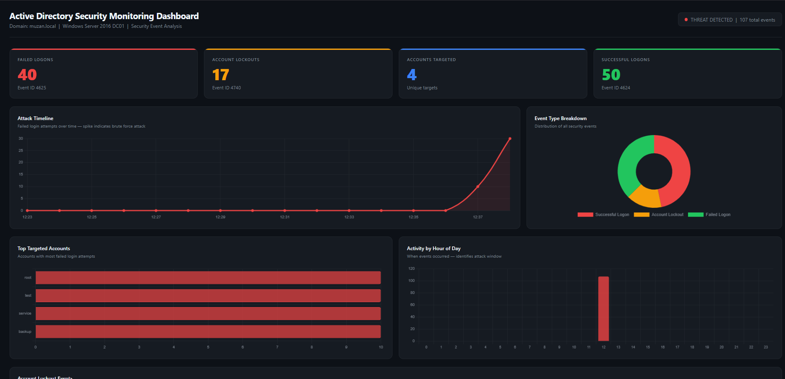
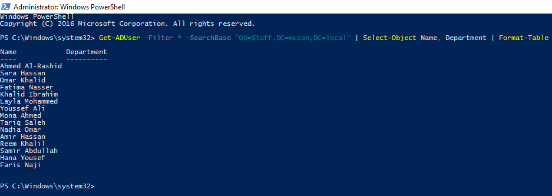

# Active Directory Security Monitoring Dashboard

An Active Directory home lab simulating brute force attacks and visualising 
security events through a custom monitoring dashboard.

## Overview

This project builds a Windows Server Active Directory environment from scratch, 
simulates a brute force attack against domain accounts, captures real Windows 
Security Event logs, and visualises the results in a custom monitoring dashboard.

## Screenshots

### Security Monitoring Dashboard

### Active Directory Environment

## Environment

| Component | Details |
|---|---|
| Operating System | Windows Server 2016 |
| Platform | Oracle VirtualBox |
| Domain | muzan.local |
| Domain Controller | DC01 |
| Scripting | PowerShell |
| Data Processing | Python 3 |
| Dashboard | Python, Chart.js, HTML |

## Project Structure

| File | Description |
|---|---|
| Create-ADUsers.ps1 | Bulk provisions users from a CSV file into Active Directory |
| Create-Groups.ps1 | Creates security groups and assigns users by department |
| Simulate-BruteForce.ps1 | Simulates brute force authentication attempts against domain accounts |
| Export-SecurityLogs.ps1 | Extracts and exports Windows Security Event logs to CSV |
| generate_dashboard.py | Processes exported logs and generates a browser-based monitoring dashboard |
| users.csv | Sample user data used for bulk account provisioning |

## How It Works

**Step 1 — Environment Setup**
Deploy Windows Server 2016 in VirtualBox and configure Active Directory 
Domain Services with a new domain.

**Step 2 — User Provisioning**
Run Create-ADUsers.ps1 to bulk create users from the CSV file, then run 
Create-Groups.ps1 to create security groups and assign users by department.

**Step 3 — Attack Simulation**
Configure the domain lockout policy and run Simulate-BruteForce.ps1 to 
simulate a brute force attack. The script targets all domain accounts with 
repeated failed authentication attempts, triggering account lockouts.

**Step 4 — Log Export**
Run Export-SecurityLogs.ps1 to extract Windows Security Events including 
failed logons (4625), account lockouts (4740), and successful logons (4624).

**Step 5 — Dashboard**
Run generate_dashboard.py to process the exported CSV and generate a 
browser-based security monitoring dashboard.

## Results

| Metric | Value |
|---|---|
| Total users provisioned | 15 |
| Security groups created | 6 |
| Failed logon attempts | 40 |
| Account lockouts | 17 |
| Total events captured | 107 |

## Dashboard Features

- KPI cards showing failed logons, account lockouts, accounts targeted, and successful logons
- Attack timeline visualising the brute force spike over time
- Event type breakdown across all captured security events
- Top targeted accounts by failed login attempts
- Activity by hour of day identifying the attack window
- Full account lockout table with timestamps

## Skills Demonstrated

- Active Directory Administration (Windows Server 2016, AD DS)
- PowerShell Scripting and Automation
- Windows Security Event Log Analysis (Event Viewer, PowerShell)
- Brute Force Attack Simulation (PowerShell, net use authentication)
- Data Processing and Log Analysis (Python, CSV)
- Security Dashboard Development (Python, Chart.js, HTML)
- Virtualisation (Oracle VirtualBox)

## Author

Muzan Abbas
